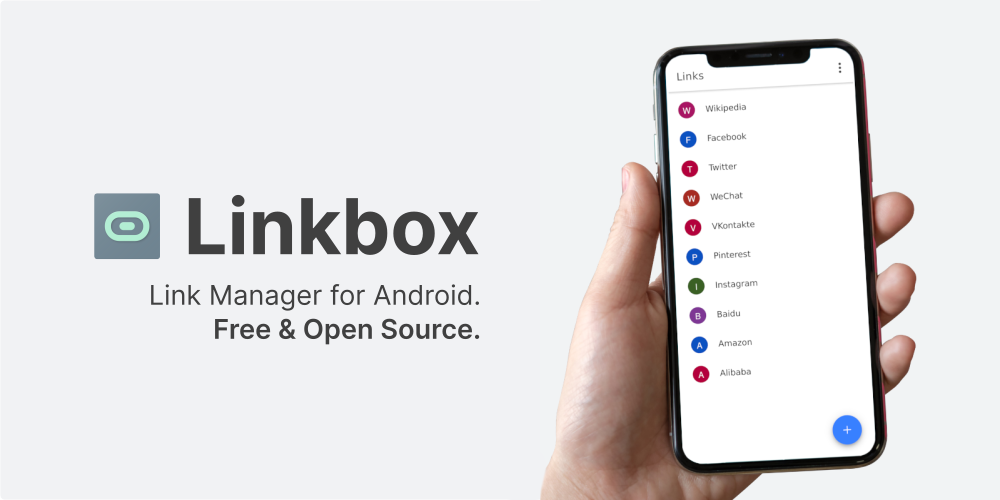
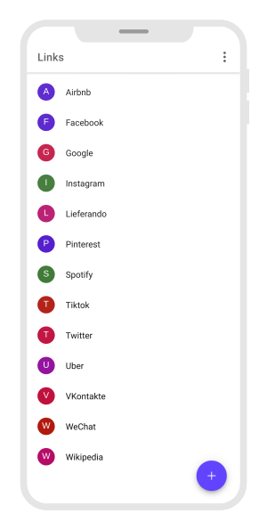
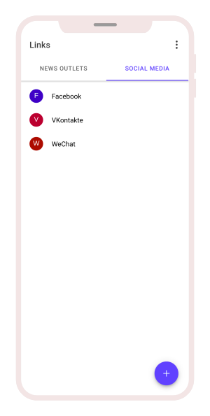
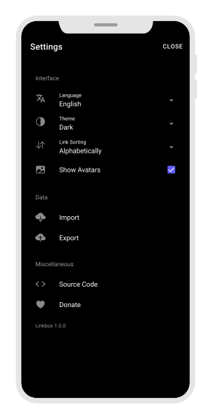
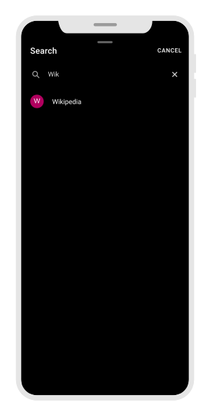

  

  

Linkbox is a <strong>free and open source link manager</strong> for Android.

## Features

- Organize links using **folders**
- **No internet** connection required
- **No ads** and **no tracking**
- True black theme as **dark mode**
- Easy **import and export** of all data and settings using simple JSON files
- Link **sharing**

## Screenshots

## Changelog

Current version is **1.0.0**.

Refer to the [changelog](changelog.md) for release notes.

## Contributing

Any kind of contribution is **welcome**.

If you encounter any **bugs** or have **ideas** to improve Linkbox, please open an [issue](https://github.com/ronaldloyko/linkbox/issues).

Before contributing, please consult the [contribution guide](contributing.md) to get started.

### Translations

## License

[MIT](license.md)
