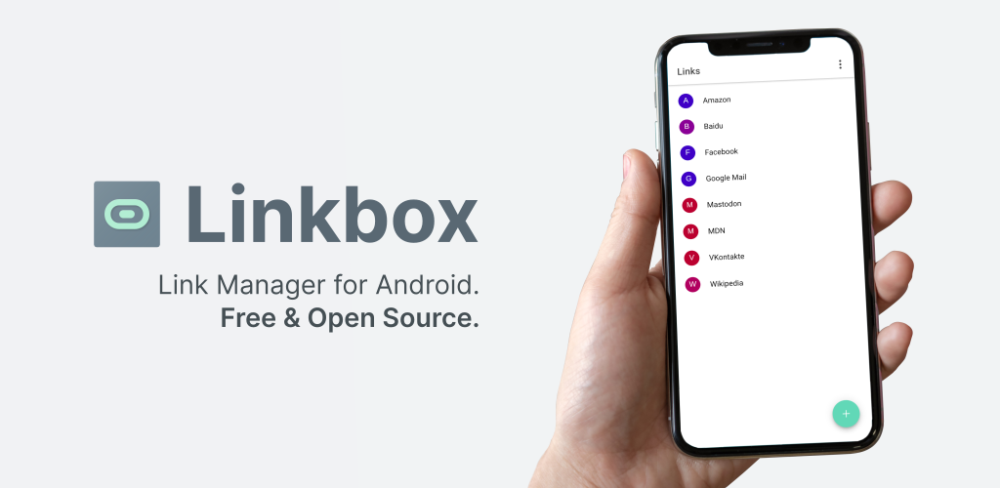
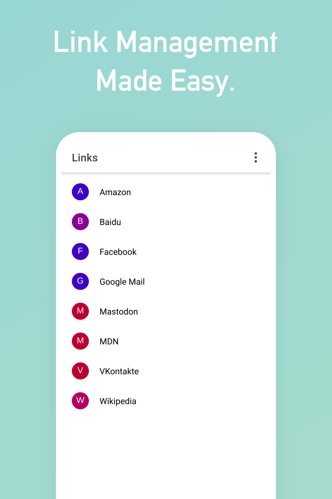

  

  

Linkbox lets you <strong>manage your links easily.</strong>

## Features

- Organizing links using **tabs**
- **No internet** connection required
- **No ads** and **no tracking**
- True black theme as **dark mode**
- Easy **import and export** of all data and settings using simple JSON files
- Adding **new links** easily by sharing them with Linkbox (e.g. from Firefox or Chrome)
- **Sharing** links to contacts

## Screenshots

## Changelog

Current version is **1.1.0**.

Refer to the [changelog](changelog.md) for release notes.

## Contributing

Any kind of contribution is **welcome**.

If you encounter any **bugs** or have **ideas** to improve Linkbox, please open an [issue](https://github.com/ronaldloyko/linkbox/issues).

Before contributing, please consult the [contribution guide](contributing.md) to get started.

### Translations

## To Do

- [ ] [Tagging System](https://github.com/ronaldloyko/linkbox/issues/11)
- [ ] [Import & Export HTML Bookmarks](https://github.com/ronaldloyko/linkbox/issues/7)
- [ ] [Progressive Web Application](https://github.com/ronaldloyko/linkbox/issues/16)
- [ ] [Publish To Play Store](https://github.com/ronaldloyko/linkbox/issues/17)

## License

[MIT](license.md)
